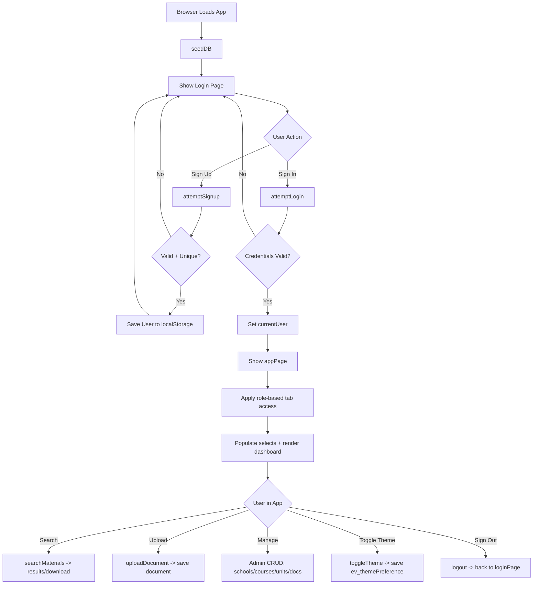
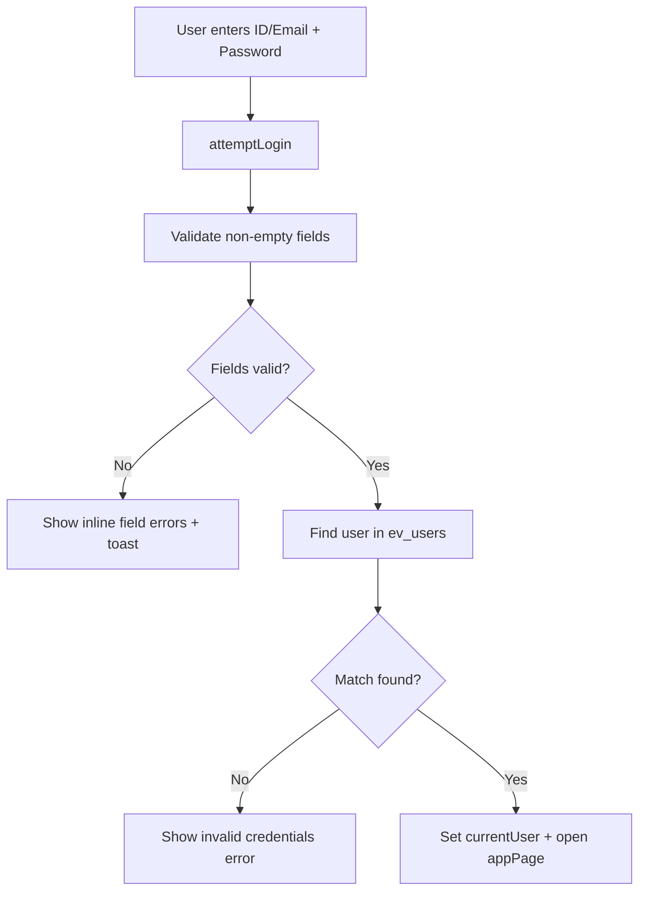

# UP-GRADE Student Study Portal: Documentation

## 1. Overview
UP-GRADE is a front-end student study portal built with plain HTML, CSS, and JavaScript.  
It uses `localStorage` as an in-browser database to support:

- Authentication (`Sign In` / `Sign Up`)
- Material search and download
- Material upload (PDF)
- Academic structure management (schools, courses, units)

The application has two main pages:

- `#loginPage` (login/signup)
- `#appPage` (main portal after successful login)

---

## 2. Project Files

- `index.html`: UI structure for login page and main app page
- `styles.css`: full styling and responsive layout
- `app.js`: business logic, local storage data layer, authentication, search/upload/admin functions

---

## 3. Runtime Model

The app runs entirely in the browser:

1. On load, `seedDB()` initializes default data if not already seeded.
2. Users authenticate from `localStorage` (`ev_users`).
3. Main portal uses role-based UI visibility:
   - `student`: search/download only
   - `lecturer`: search + upload
   - `admin` (or non-student/non-lecturer): search + upload + manage

---

## 4. Data Storage (localStorage)

All keys are prefixed with `ev_` via the `DB` helper.

- `ev_seeded`: boolean initialization flag
- `ev_users`: user accounts
- `ev_schools`: list of schools/faculties
- `ev_courses`: map of school -> courses
- `ev_units`: map of course -> units
- `ev_documents`: uploaded/sample documents
- `ev_themePreference`: selected theme (`light` or `dark`)

### User object
```js
{
  id: "STU001",
  name: "Jane Doe",
  email: "jane@uni.ac.ke",
  password: "******",
  role: "student" // student | lecturer | admin
}
```

### Document object
```js
{
  id: "doc_1712345678901",
  title: "Data Structures Notes",
  school: "Faculty of Science",
  course: "BSc Computer Science",
  unit: "Data Structures & Algorithms",
  type: "study", // study | past
  year: "2024",
  uploadedBy: "Jane Doe",
  date: "2026-05-12",
  size: "2.4 MB",
  fileName: "notes.pdf",
  fileData: "data:application/pdf;base64,..."
}
```

---

## 5. Main Functional Flow



---

## 6. Authentication Flow



---

## 7. Major JavaScript Modules

- `DB.get / DB.set`: wrapper for `localStorage` JSON read/write
- `seedDB()`: initializes default academic data and sample docs
- Auth:
  - `attemptLogin()`
  - `attemptSignup()`
  - `toggleSignup()`
  - `logout()`
- Theme:
  - `applyTheme()`
  - `initializeTheme()`
  - `toggleTheme()`
- Navigation:
  - `switchTab()`
- Search:
  - `populateSearchSelects()`
  - `onSchoolChange()`
  - `onCourseChange()`
  - `searchMaterials()`
  - `clearSearch()`
- Upload:
  - `handleFileSelect()/handleDrop()/processFile()`
  - `uploadDocument()`
  - `resetUploadForm()`
- Download:
  - `downloadDoc()`
- Admin/Manage:
  - `renderStats()`, `renderAllDocs()`, `renderRecentUploads()`
  - CRUD for schools/courses/units/docs

---

## 8. UI/UX Notes

- Main app tab visibility is role-driven.
- Upload accepts PDF only and enforces 10MB max.
- Toast notifications are centralized via `showToast()`.
- Responsive behavior is defined in `styles.css` under `@media (max-width: 900px)`.

---

## 9. How to Run

1. Open `index.html` in a browser.
2. Sign up a user account.
3. Sign in using that account.
4. Explore search/upload/manage based on role.

Note: Since this is localStorage-based, data is browser-specific and persists until local storage is cleared.
